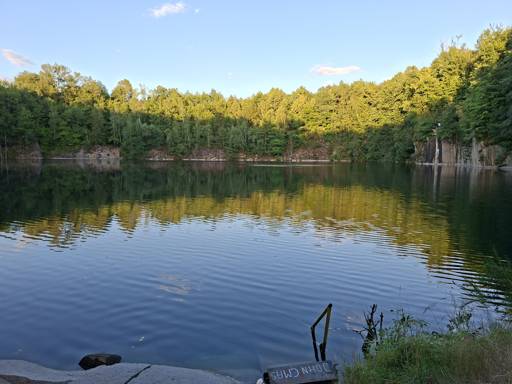

import ArticleImage from '../../components/ArticleImage.astro';

While Europe has been struggling under record heatwaves, little treasures—some sweet and sour, burgundy and red pink—started to pop up on our trees and bushes. As I realized, I could name only few of them in English out of my head, I had to look up the rest. Cherries and sour cherries[^1], red and black currants, gooseberries. Also the tricky little hybrid plant creature called jostaberry that eluded me even in my native Polish[^2]. It is hybrid of gooseberries and black currants.

[^1]: In Polish we have separate name for sweet varieties (czereśnie) and for sour ones (wiśnie), so I felt obliged to mention sour berries explicitly. 

[^2]: "Porzeczkoagrest" or "agrestoporzeczka" is straightforward indicator of which species get hybridized. "Porzeczka" means "currant" and "agrest" means "gooseberry".

I am spending the whole summer this year at my parents' place. Well, since my accident I am here constantly since the last December, so it's more than the summer.

<ArticleImage 
    imagePath={"/src/assets/notes/fruit-garden/quarry2.jpg"} 
    altText={'Submerged quarry in my village'}
    description='Submerged quarry in my village' />

